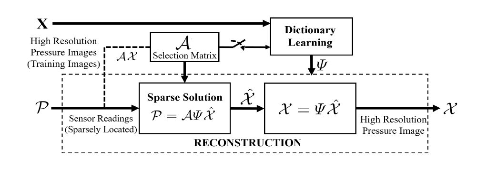

# Plantar Pressure Reconstruction Using Compressive Sensing

This is the MATLAB code for the paper [Spatially-Continuous Plantar Pressure Reconstruction Using Compressive Sensing](http://proceedings.mlr.press/v68/farnoosh17a.html)
 
<p align="center" width="100%">
   
</p>

* The m-files `KSVD.m`, `KSVD_NN.m`, `OMP.m`, `OMPerr.m`, `NN_BP.m`, and `my_im2col.m` are taken from [here](https://github.com/hbtsai/dip_sr/tree/master/matlab_ref/Lib/KSVD) with slight modifications. These m-files implement K-SVD algorithm proposed in: [The K-SVD: An Algorithm for Designing of Overcomplete Dictionaries for Sparse Representation](https://sites.fas.harvard.edu/~cs278/papers/ksvd.pdf).
 
## Dataset

The dataset comes from the original work of [A knowledge-based modeling for plantar pressure image reconstruction](https://ieeexplore.ieee.org/abstract/document/6813648/) and is placed in `./Dataset/` directory. It includes plantar pressure readings from 5 healthy subjects (right/left foot), and is augmented with the corresponding GMM centroids and variances from their method, as well as other information/preprocessing needed for our method.   

## Training and Evaluation 

* Run `learningtest.m` and set `dict.learn` flag to learn dictionary, and get evaluation plots for each specified subject and foot. You may set `dict.learn = 0` if you wish to use pretrained dictionaries in `./Dictionaries/` directory to get evaluation plots.

* Run `analyzeAll.m` to get aggregated evaluation results for all subjects and feet. Again set `dict.learn = 0` if you want to use the pretrained dictionaries.

* Uncomment the corresponding lines (40-43) in `testallfunc.m` if you want to switch between sparse reconstruction (`fpreconst`), interpolation (`fpreconst_interp`), and GMM method (`fpreconst_gmm`). 

* Edit line 32 of `testallfunc.m` to specify the set of number of sensors (K) for which you want to get evaluation results. By default K is from 4 sensors (atleast) to 46.  

* Set the corresponding figure flags to get the desired graphs.   

## Citation 
If you find our work useful in your research please consider citing our paper:

```
@inproceedings{farnoosh2017spatially,
  title={Spatially-Continuous Plantar Pressure Reconstruction Using Compressive Sensing},
  author={Farnoosh, Amirreza and Ostadabbas, Sarah and Nourani, Mehrdad},
  booktitle={Machine Learning for Healthcare Conference},
  pages={13--24},
  year={2017}
}
```
